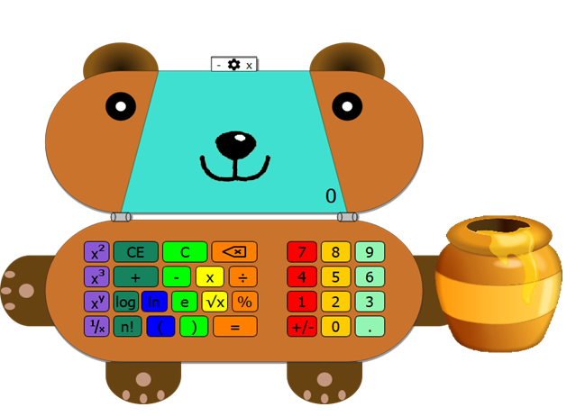

# Teddy-Bear-Calculator
# Animated-Wallpaper

## Overview
A cute teddy bear shaped calculator for any children to have fun making calculations.  

## Prerequisites
Qt Creator and any Qt version starting with 5.13

## Build
Open calculator.pro file, wait for project to load and press build. 
Repeat same steps with calculator_exe.pro file.
